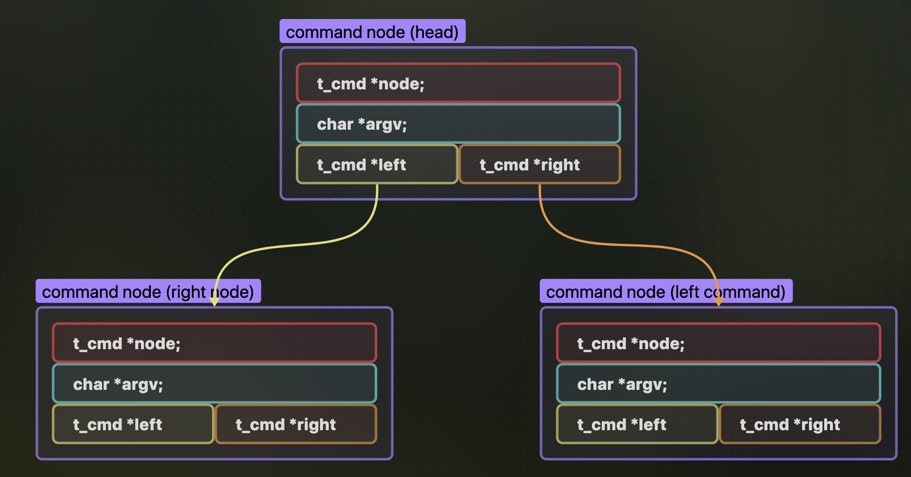
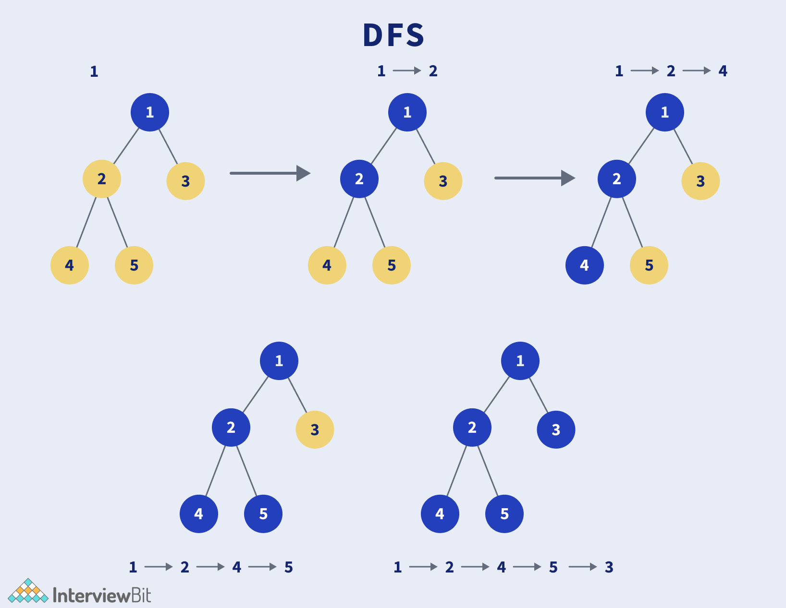

# Parsing -> Execution (Linking The Two):

As we dive into the Minishell project, i will be handling the execution, i'm expecting the output from the parser to be the root to an abstract syntax tree structure.

## Abstract Syntax Tree (Parsing Output):

```c
typedef struct s_cmd
{
	t_cmd_id id; // command type (cmd, redir, pipe)
	
	char **argv; // command arguments, null if anything else
	
	struct s_cmd *right; // right cmd
	struct s_cmd *left; // left cmd
	
	t_osdata *osdata; // pointer to my data struct in main.

} t_cmd;
```

the command node is defined as follows, forming a linked structure in the form of a binary tree,
called a binary tree for it having two possible directions to traverse ⬅️ left and ➡️ right.



this also contains helpful information such is the command id.

```c
	t_cmd_id id; // command type (cmd, redir, pipe)
```

which could be :

```c
typedef enum e_cmd_id
{
	O_CMD, // simple command
	O_REDIR, // redirect to file, either in or out
	O_PIPE, // piping, redirect input of cmd1 to cmd2 output
	O_OR, // or operator, only run B if A fails
	O_AND, // and operator, only run B if A succeds
}    t_cmd_id;
```

this could be adjustable and we can add more command types as we go for example redirections and sub-shells  if needed.

okay now that we have an idea of the the tree will be handed from parsing we can advance with the execution algorithm.

## Execution Entry :

The First line the execution will start from in the
```c
								int main(void);
```

The execute function takes in the root of the tree (address to the first node), and a data structure holding everything needed including env variables and exit status and so on...

```c
					int execute_tree(root, data_struct);
```

it will be called from the main function like this : 

```c
int main(int argc, char **argv, char **env)
{
	// all needed variable declarations here ...
	// main reading loop ...
	while (true)
	{
		// readline ...
		// tokenize and build tree (parsing part) ...
		// .......
		
		// --->	execute_tree(root, data_struct);
		// .......
	}
	return (EXIT_SUCCESS);
}
```

### exucute_tree(node, ...) :

```C
int  execute_tree(t_cmd *root, t_osdata *osdata)
{
	if (!root)
		return (EXIT_FAILURE);
	return (recursive_execution(root, osdata));
}
```

first check if the tree is empty, if so `root == NULL` exit with failure.

if the tree is already empty and doesn't point to anything no need for cleanup.\
and then after this we enter our recursive executer function 

#### recursive_execution :

```c
					int recursive_execution(root, osdata)
```

this is function is responsible for the entire recursive traversal and execution, it uses DFS
depth-first-search traversal pattern, where it goes as deep as possible to the left and evaluating and executing the commands, while backtracking to the right.




```c
int recursive_execution(t_cmd *node, t_osdata *osdata)
{
    if (!node)
        return (EXIT_FAILURE);
    if (node->id == O_CMD) // base case exec cmd
    {
        expand_env_variables(node, osdata->env);
        if (validate_builtin(node->argv[0]) == true)
            return (exec_builtin(node, osdata));
        return (exec_node(node, osdata));
    }
    if (node->id == O_PIPE)
        return (execute_pipeline(node, osdata, STDIN_FILENO, false));
    if (node->id == O_GROUP)
        return (recursive_execution(node->left, osdata));
    if (node->id == O_AND || node->id == O_OR)
        return (short_circuit_operand(node, node->id, osdata));
    if (node->left)
        return (recursive_execution(node->left, osdata));
    if (node->right)
        return (recursive_execution(node->right, osdata));
    return (EXIT_SUCCESS);
}
```

This is the entire algo so far. let's start explaining it bit by bit in detail, but let's ignore some details for now, and explain a simple cmd and left and right recursion and explain the other complex functions in their own chapters.

```c
    if (!node)
        return (EXIT_FAILURE);
    if (node->id == O_CMD)
        return (exec_node(node, osdata));
    
    if (node->id == O_AND || node->id == O_OR)
        return (short_circuit_operand(node, node->id, osdata));
    if (node->left)
        return (recursive_execution(node->left, osdata));
    if (node->right)
        return (recursive_execution(node->right, osdata));
    return (EXIT_SUCCESS);
```

first just a check if the node is valid `node != NULL`, assuming the parser will always put the command nodes which are my base case at the end of the branches, this will never happen, but just incase this condition is here for protection.

##### node == CMD :

This is My base case if we hit a command node, we call the exec node function, which forks a new process and uses the execve system call to execute the given command.

